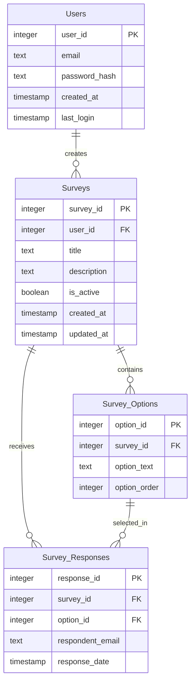

```mermaid
erDiagram
    Users ||--o{ Surveys : creates
    Surveys ||--o{ Survey_Options : contains
    Surveys ||--o{ Survey_Responses : receives
    Survey_Options ||--o{ Survey_Responses : selected_in

    Users {
        integer user_id PK
        text email
        text password_hash
        timestamp created_at
        timestamp last_login
    }

    Surveys {
        integer survey_id PK
        integer user_id FK
        text title
        text description
        boolean is_active
        timestamp created_at
        timestamp updated_at
    }

    Survey_Options {
        integer option_id PK
        integer survey_id FK
        text option_text
        integer option_order
    }

    Survey_Responses {
        integer response_id PK
        integer survey_id FK
        integer option_id FK
        text respondent_email
        timestamp response_date
    }
```
